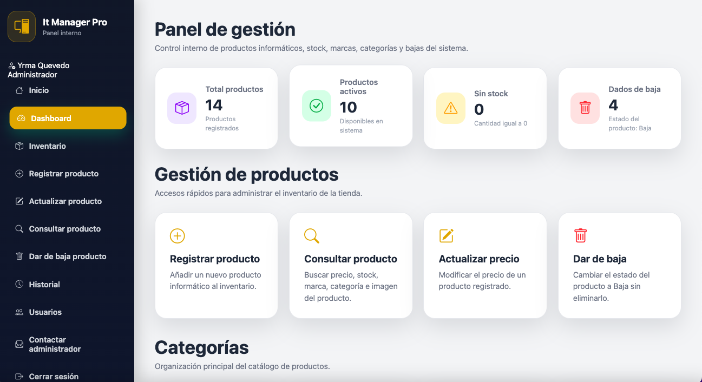
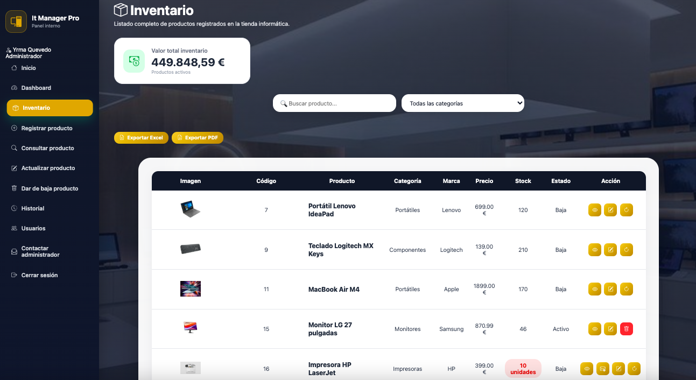
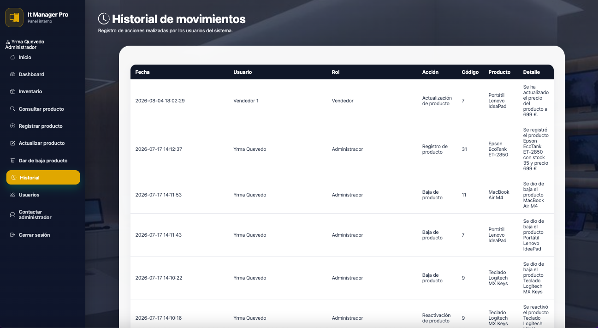
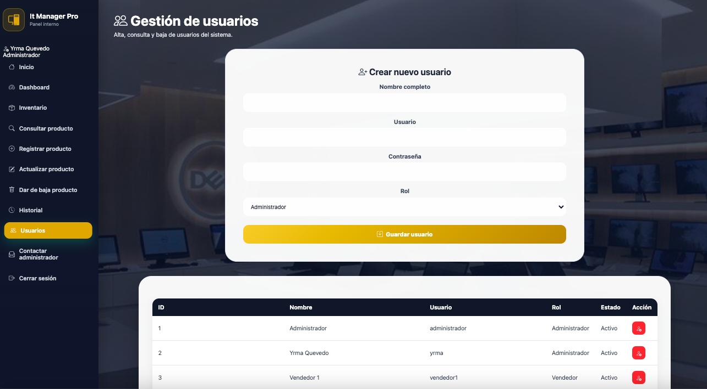

<p align="center">
  
</p>

<div align="center">

# 🖥️ Web It Manager Pro

### Sistema web de gestión de inventario informático

**Proyecto Final · Desarrollo de Aplicaciones Web**

Aplicación web para la gestión integral de un inventario de productos informáticos.

</div>

---

## 📌 Sobre el proyecto

**Web It Manager Pro** es una aplicación web desarrollada para gestionar de forma centralizada el inventario de una tienda informática.

El sistema permite administrar productos, controlar el stock, consultar y actualizar información, realizar bajas lógicas, gestionar usuarios y registrar las acciones realizadas dentro de la aplicación.

Además, incorpora funcionalidades como el envío automático de avisos de stock mediante correo electrónico y la exportación del inventario en formatos PDF y Excel.

---

## ⚙️ Funcionalidades principales

La aplicación incluye diferentes módulos para la gestión y control del inventario:

- 🔐 **Inicio de sesión y control de acceso**
  - Autenticación de usuarios.
  - Gestión de sesiones.
  - Control de permisos según el rol del usuario.

- 📊 **Dashboard de gestión**
  - Visualización del número total de productos.
  - Control de productos activos.
  - Identificación de productos sin stock.
  - Visualización de productos dados de baja.

- 📦 **Gestión de inventario**
  - Registro de nuevos productos.
  - Consulta de productos.
  - Actualización de información y precios.
  - Control de stock.
  - Baja lógica de productos.
  - Reactivación de productos.

- 👥 **Gestión de usuarios**
  - Registro de nuevos usuarios.
  - Asignación de roles.
  - Activación y desactivación de usuarios.
  - Control de permisos.

- 🕒 **Historial de movimientos**
  - Registro de las acciones realizadas dentro del sistema.
  - Identificación del usuario que realiza cada operación.
  - Registro de fecha, producto y detalle de la acción.

- 📧 **Avisos de stock**
  - Envío de avisos mediante correo electrónico.
  - Integración con PHPMailer.
  - Correos HTML personalizados con información del producto.

- 📄 **Exportación de información**
  - Exportación del inventario a Excel.
  - Generación de informes en PDF.

- ✉️ **Contacto con administrador**
  - Formulario interno de contacto.
  - Envío de mensajes por correo electrónico.

 ---

## 🛠️ Tecnologías utilizadas

| Tecnología | Uso en el proyecto |
|---|---|
| **PHP** | Desarrollo de la lógica del servidor y gestión de las operaciones del sistema. |
| **MySQL** | Almacenamiento y gestión de productos, usuarios e historial de movimientos. |
| **HTML5** | Estructura de las diferentes páginas de la aplicación. |
| **CSS3** | Diseño visual, distribución de elementos y adaptación de la interfaz. |
| **Bootstrap Icons** | Iconografía utilizada en la interfaz del sistema. |
| **JavaScript** | Interactividad y funcionalidades en el lado del cliente. |
| **Composer** | Gestión de dependencias PHP del proyecto. |
| **PHPMailer** | Envío de correos electrónicos y avisos de stock desde la aplicación. |

---

## 📁 Estructura del proyecto

El proyecto está organizado en diferentes directorios según la función de cada componente:

```text
WebItManagerPro/
│
├── bd/
│   ├── conexion.php
│   └── variables.php
│
├── config/
│   └── mail.php.example
│
├── css/
│   └── style.css
│
├── formularios/
│   ├── actualizar.html
│   ├── avisoStock.php
│   ├── borrar.html
│   ├── consulta.php
│   ├── contactoAdmin.php
│   ├── gestion.php
│   ├── historial.php
│   ├── inventario.php
│   ├── registro.html
│   └── usuarios.php
│
├── img/
│   └── Imágenes y recursos gráficos
│
├── includes/
│   ├── permisos.php
│   └── seguridad.php
│
├── js/
│   └── script.js
│
├── login/
│   ├── login.php
│   ├── logout.php
│   └── validarLogin.php
│
├── php/
│   ├── actualizarProducto.php
│   ├── borrarProducto.php
│   ├── cambiarEstadoUsuario.php
│   ├── consultaProducto.php
│   ├── eliminarProducto.php
│   ├── enviarAvisoStock.php
│   ├── enviarCorreo.php
│   ├── exportarExcel.php
│   ├── exportarPDF.php
│   ├── guardarPrecio.php
│   ├── guardarUsuario.php
│   ├── insertarProducto.php
│   └── reactivarProducto.php
│
├── .gitignore
├── composer.json
├── composer.lock
└── index.html

```

---

## 🗄️ Base de datos

La aplicación utiliza **MySQL** para almacenar y gestionar la información del sistema.

La base de datos permite mantener relacionados los productos, usuarios y movimientos realizados dentro de la aplicación.

### Información gestionada

- **Productos:** código, nombre, descripción, precio, stock, categoría, marca y estado.
- **Usuarios:** datos de acceso, rol y estado del usuario.
- **Historial de movimientos:** registro de las acciones realizadas dentro del sistema, incluyendo usuario, fecha, producto y detalle de la operación.

Las operaciones sobre la base de datos se realizan desde PHP mediante la conexión definida en el proyecto.

---

## 🔐 Seguridad y configuración

El proyecto incorpora diferentes medidas para proteger el acceso a la aplicación y evitar la publicación de información sensible.

### Control de acceso

- Autenticación mediante usuario y contraseña.
- Gestión de sesiones mediante PHP.
- Control de acceso según el rol del usuario.
- Restricción de determinadas funcionalidades a usuarios autorizados.

### Protección de credenciales

Las credenciales utilizadas para el envío de correos electrónicos se almacenan en un archivo de configuración local que no se incluye en el repositorio.

El archivo:

`config/mail.php`

está excluido mediante `.gitignore` para evitar la publicación de datos sensibles.

El repositorio incluye el archivo:

`config/mail.php.example`

como plantilla para configurar las credenciales necesarias en cada instalación.

---

## 🖥️ Capturas de la aplicación

### Panel de gestión

Vista principal del panel administrativo con información general del inventario y accesos a las principales funcionalidades.

<p align="center">
  
</p>

### Gestión del inventario

Consulta general de los productos registrados, con información de stock, categoría, marca, precio y estado.

<p align="center">
  
</p>

### Historial y usuarios

<table>
  <tr>
    <td width="50%">
      
    </td>
    <td width="50%">
      
    </td>
  </tr>
  <tr>
    <td align="center"><b>Historial de movimientos</b></td>
    <td align="center"><b>Gestión de usuarios</b></td>
  </tr>
</table>
