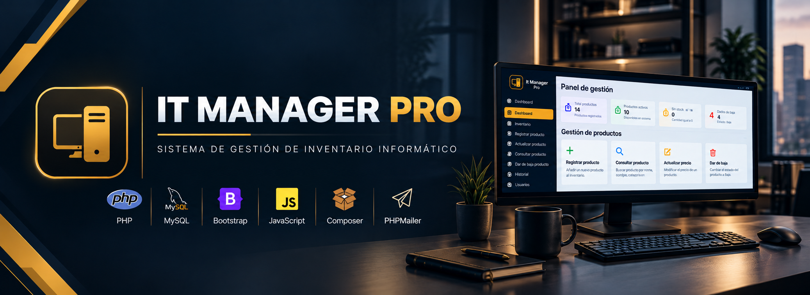

  

# 🖥️ Web It Manager Pro

### Sistema web de gestión de inventario informático

**Proyecto Final · Desarrollo de Aplicaciones Web**

Aplicación web para la gestión integral de un inventario de productos informáticos.

---

## 📌 Sobre el proyecto

**Web It Manager Pro** es una aplicación web desarrollada para gestionar de forma centralizada el inventario de una tienda informática.

El sistema permite administrar productos, controlar el stock, consultar y actualizar información, realizar bajas lógicas, gestionar usuarios y registrar las acciones realizadas dentro de la aplicación.

Además, incorpora funcionalidades como el envío automático de avisos de stock mediante correo electrónico y la exportación del inventario en formatos PDF y Excel.
